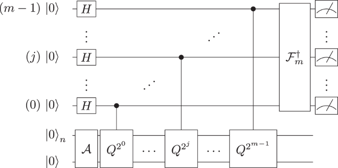

# Canonical Amplitude Estimation (Brassard et al.)

The original Quantum Amplitude Estimation algorithm, introduced by Brassard, Hoyer, Mosca, and Tapp in 2000, answers a deceptively simple question: *given a quantum state, how large is the "good" component?*

More precisely, given a unitary A that prepares

&nbsp;&nbsp;&nbsp;&nbsp;A|0⟩ = √(1 − a) |Ψ₀⟩ + √a |Ψ₁⟩

the algorithm estimates the amplitude a — the probability of measuring the "good" state |Ψ₁⟩.

## Why it matters

Amplitude estimation is one of the most versatile subroutines in quantum computing. It provides a quadratic speedup over classical sampling and serves as the backbone for quantum algorithms in Monte Carlo simulation, option pricing, risk analysis, and combinatorial optimization. If Grover's search is a hammer, amplitude estimation is the measuring tape that tells you how much you found.

## How it works

The algorithm chains together two well-known building blocks:

1. **Grover operator** (Q) — reflects the quantum state to amplify the good component. The eigenvalues of Q are e^(±2iθₐ) where θₐ ∈ [0, π/2] is the amplitude angle defined by sin²(θₐ) = a, so recovering θₐ gives us a.
2. **Quantum Phase Estimation (QPE)** — extracts the normalized phase θₐ/π using m auxiliary "evaluation" qubits, producing an estimate on a discrete grid of 2^m points.

Because the grid is discrete, the raw QPE output snaps to the nearest grid point. Modern implementations (including this one, which derives from Qiskit Algorithms) add a **Maximum Likelihood Estimation (MLE)** post-processing step — not part of the original Brassard et al. construction — that refines the snapped estimate to a continuous value, recovering better precision without additional quantum resources.



The evaluation register (top m qubits) holds the Hadamard superposition and receives the phase via controlled-Q^(2^k) operations; the eigenstate register (bottom n qubits) carries the amplitude-encoded state prepared by A. Inverse QFT on the evaluation register reads out the phase.

## What the example does

This is a **reference implementation** — the algorithm handles any Bernoulli probability and any number of evaluation qubits. The defaults below are just the out-of-the-box configuration; change them via the CLI to study the precision/depth tradeoff.

The example uses a **Bernoulli model** (the simplest amplitude estimation problem): a single-qubit A operator that rotates |0⟩ into a superposition with amplitude √p of the "good" state |1⟩. The algorithm reports the raw grid-based estimate, the MLE-refined continuous estimate, and a 95% Fisher confidence interval.

## Default parameters

| Parameter | Value |
|-----------|-------|
| Target probability (p) | 0.2 |
| Evaluation qubits (m) | 3 (grid resolution 2^3 = 8 points) |
| Shots | 1000 |

With these defaults, the grid-based output snaps to the nearest point of the 8-point grid (~0.146), while the MLE post-processing typically recovers a value close to the true 0.2.

## Getting started

```bash
python -m venv .venv && source .venv/bin/activate
pip install -r requirements.lock
python amplitude_estimation.py
```

### CLI options

```
python amplitude_estimation.py -p 0.35 -m 5 -S 5000
```

| Flag | Description | Default |
|------|-------------|---------|
| `-p` / `--probability` | Target Bernoulli probability in (0, 1) | 0.2 |
| `-m` / `--eval-qubits` | Number of evaluation qubits (grid = 2^m) | 3 |
| `-S` / `--shots` | Shots for the QPE circuit (must be ≥ 1) | 1000 |

Increasing `-m` improves precision but deepens the circuit. Increasing `-S` reduces sampling noise in the grid-based estimate and stabilizes the MLE refinement.

## Project structure

```
├── amplitude_estimation.py            # Entry point (parameterized)
├── amplitude_estimation_class.py      # Core QAE algorithm (QPE + MLE)
├── qae_structure.png                  # Canonical algorithm diagram
├── lib/                               # Framework base classes
│   ├── algorithm_result.py
│   ├── amplitude_estimator.py
│   ├── estimation_problem.py
│   └── utils.py
└── assembly/
    └── openqasm3/
        └── amplitude_estimation.qasm  # Pre-exported OpenQASM 3.0 circuit
```

## Dependencies

- Python 3.12
- [Qiskit](https://qiskit.org/) (< 2.0)
- NumPy, SciPy

## References

- Brassard, G., Hoyer, P., Mosca, M., & Tapp, A. (2000). *Quantum Amplitude Amplification and Estimation.* [arXiv:quant-ph/0005055](https://arxiv.org/abs/quant-ph/0005055)

## License

Apache 2.0 — derived from [Qiskit Algorithms](https://github.com/qiskit-community/qiskit-algorithms) (C) IBM 2018–2024.
