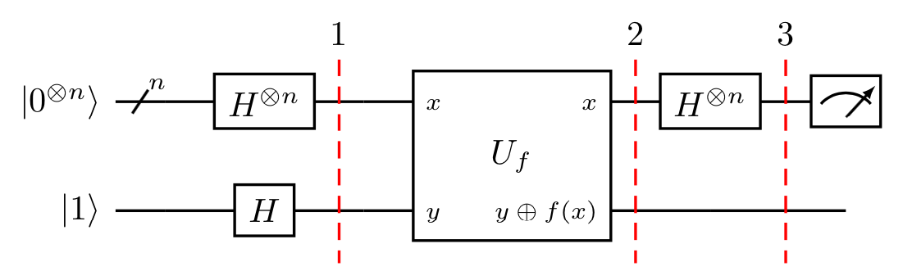

# Deutsch-Jozsa Algorithm

The Deutsch-Jozsa algorithm (1992) is one of the first problems where a quantum computer provably outperforms any deterministic classical algorithm. It answers a simple yes-or-no question: *is a given Boolean function constant (same output for all inputs) or balanced (outputs 0 for exactly half the inputs and 1 for the other half)?*

Classically, you need up to 2^(n−1) + 1 queries in the worst case to be certain. The quantum algorithm decides it in **exactly one query** — an exponential separation that, while not practically useful on its own, was a pivotal early proof that quantum interference could be harnessed for computation.

## How it works

The algorithm exploits the fact that a Hadamard transform, followed by an oracle query, followed by another Hadamard transform, creates constructive or destructive interference depending on the oracle's structure:

1. **Initialize** n input qubits in |0⟩ and one output qubit in |1⟩.
2. **Apply Hadamard** gates to all qubits, creating an equal superposition.
3. **Query the oracle** — it encodes the Boolean function f as a phase kickback.
4. **Apply Hadamard** again to the input qubits.
5. **Measure** — if all input qubits read |0⟩, the function is constant; any other result means it is balanced.

The key insight is that balanced functions introduce phase differences that the final Hadamard exposes, while constant functions leave the superposition unchanged.



## What the example does

The algorithm itself works for any n; the CLI exposes `-n` for the number of input qubits. The implementation constructs both oracle types on each run:

- **Balanced oracle** — generates a random non-zero bit string and uses it to decide which qubits get X gates before and after a cascade of CNOTs. This ensures exactly half the inputs flip the output.
- **Constant oracle** — randomly outputs 0 or 1 for all inputs (either does nothing or flips the output qubit).

The example runs **both** oracle types and verifies each classification. For a balanced oracle, the all-zeros measurement outcome should never appear; for a constant oracle, it should dominate. A sanity-check assertion enforces the balanced-oracle invariant at the end of the run.

## Default parameters

| Parameter | Value |
|-----------|-------|
| Input qubits (n) | 4 |
| Shots | 1024 |

## Getting started

```bash
python -m venv .venv && source .venv/bin/activate
pip install -r requirements.lock
python deutsch_jozsa.py
```

### CLI options

```
python deutsch_jozsa.py -n 6 -S 2048
```

| Flag | Description | Default |
|------|-------------|---------|
| `-n` / `--n-qubits` | Number of input qubits (n ≥ 1) | 4 |
| `-S` / `--shots` | Number of simulation shots | 1024 |

## Dependencies

- Python 3.12
- [Qiskit](https://qiskit.org/) (< 2.0)
- Qiskit Aer
- NumPy

## References

- Deutsch, D. & Jozsa, R. (1992). *Rapid Solution of Problems by Quantum Computation.* [doi:10.1098/rspa.1992.0167](https://doi.org/10.1098/rspa.1992.0167)

## License

Apache 2.0 — see [LICENSE](./LICENSE).
