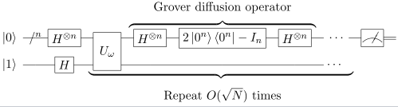
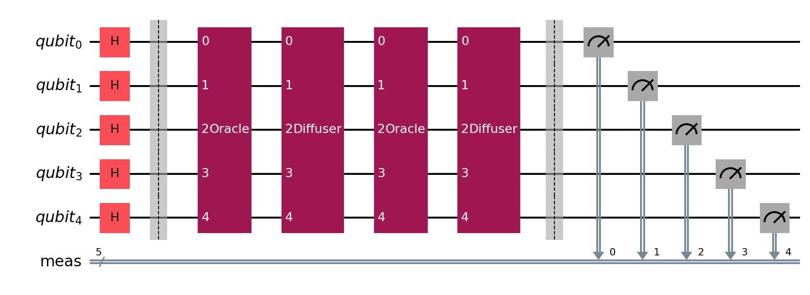
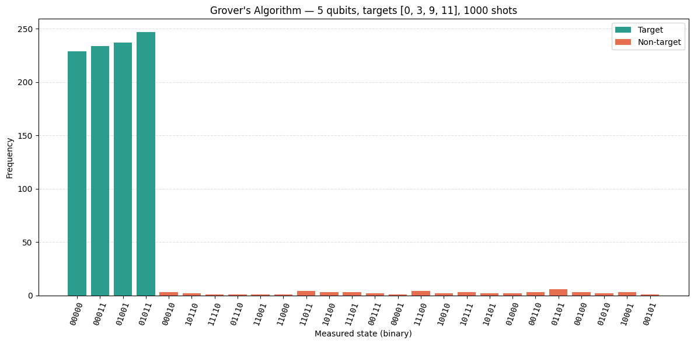

# Grover's Search Algorithm

Grover's algorithm is arguably the most famous quantum algorithm after Shor's. It solves the unstructured search problem, finding a marked item in an unsorted database of N elements in O(√N) queries, a provably optimal quadratic speedup over any classical algorithm, which needs O(N) queries in the worst case.

Beyond database search, Grover's algorithm serves as a universal subroutine: any problem that can be framed as "find an input satisfying a given condition" can be accelerated quadratically. This includes constraint satisfaction, optimization, cryptographic key search, and more.

**A note on "database":** Grover doesn't search a literal stored database. The "database" is implicit in an **oracle** — a black-box function that, when queried, says whether a given input is a target. In real applications the oracle encodes some hard-to-invert relation (e.g. "does this candidate solve this SAT instance?"). In this example, the oracle is constructed from the known target set for demonstration purposes.

## How it works

The algorithm repeatedly applies two operations — the **Grover iterate** — to amplify the probability of measuring the target state(s):

1. **Oracle** (U_ω) — marks the target states by flipping their phase: |t⟩ → −|t⟩ for each target t, leaving all other states unchanged. Implemented here via X gates (to make each target look like |1…1⟩), a multi-controlled Z gate, then the X gates again.

2. **Diffuser** (amplitude amplification) — reflects all amplitudes about their mean. Written in closed form, the diffuser is H⊗n · (2|0^n⟩⟨0^n| − I_n) · H⊗n — Hadamard all qubits, apply a phase flip on the all-zeros state, Hadamard again. This "pushes" amplitude from non-target states toward target states.

After approximately (π/4)·√(N/M) iterations (where M is the number of target states), the targets have near-unit probability. Any more or fewer and the probability drops — the amplitude is literally rotating around a 2D subspace and overshooting reverses the amplification.



## What the example does

This implementation supports multiple simultaneous search targets and includes a full CLI for experimentation. The algorithm itself is not tied to any specific qubit count or target set — the defaults below are just the out-of-the-box configuration.

The output reports the problem setup, the theoretical hit rate sin²((2k+1)θ) where θ = arcsin(√(M/N)), the measured hit rate, and a per-target frequency table so you can verify the distribution matches theory at a glance.

## Default parameters

| Parameter | Value |
|-----------|-------|
| Qubits (n) | 5 (search space N = 32) |
| Targets | {0, 3, 9, 11} (M = 4) |
| Shots | 1000 |
| Grover iterations | 2 (integer optimum of ⌊π/4 · √(N/M)⌋ = 2.22) |

With these defaults, the transpiled circuit (compound Oracle/Diffuser gates shown in purple, Hadamards in red) looks like:



And the measured distribution — 4 target peaks at ~24% each, the remaining ~5.5% spread thinly across 28 non-target states — looks like:



The theoretical hit rate is sin²(5θ) ≈ 94.5% with θ = arcsin(√(1/8)), matching the measured rate to within sampling noise at 1000 shots.

## Getting started

```bash
python -m venv .venv && source .venv/bin/activate
pip install -r requirements.lock
python grover.py
```

### CLI options

```
python grover.py -n 4 -s 5 7 -S 2000 -c
```

| Flag | Description | Default |
|------|-------------|---------|
| `-n` | Number of qubits | 5 |
| `-s` | Target integers to search for | 11 9 0 3 |
| `-S` | Number of simulation shots | 1000 |
| `-p` / `--no-p` | Print circuit diagrams | off |
| `-c` / `--no-c` | Combine non-target bars into "Others" | off |
| `-f` | Histogram font size | 10 |

## Pre-exported circuit

`assembly/openqasm3/grover_circuit.qasm` contains the default 5-qubit, 2-iteration circuit transpiled into a standard basis gate set (u3, cx, measure) and exported as OpenQASM 3.0 — useful as a reference circuit for hardware experimentation or interop without rerunning Python.

## Dependencies

- Python 3.12
- [Qiskit](https://qiskit.org/) (< 2.0)
- Qiskit Aer
- NumPy, Matplotlib

## References

- Grover, L. K. (1996). *A Fast Quantum Mechanical Algorithm for Database Search.* [arXiv:quant-ph/9605043](https://arxiv.org/abs/quant-ph/9605043)

## License

Apache 2.0 — see [LICENSE](./LICENSE).
