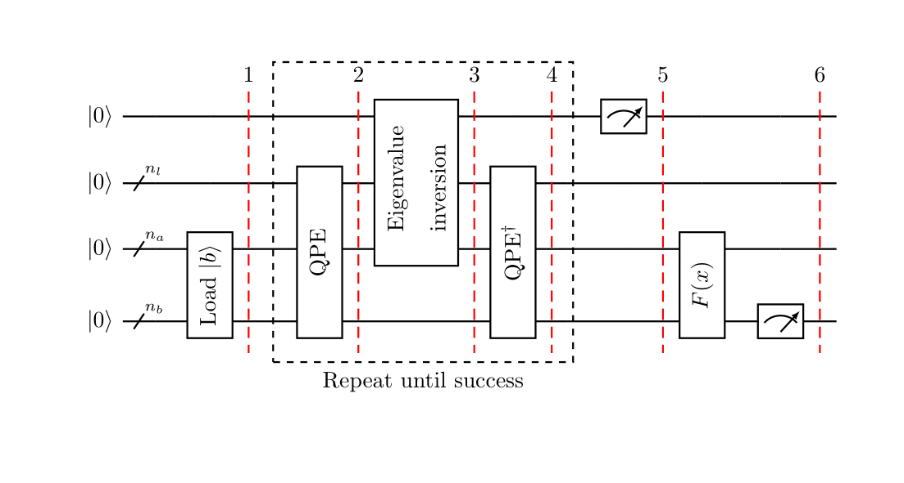

# HHL Algorithm — Quantum Linear Systems Solver

The HHL algorithm (Harrow, Hassidim, Lloyd, 2009) is a quantum algorithm for solving linear systems A𝐱 = 𝐛. For an N × N sparse Hermitian matrix with condition number κ, HHL runs in O(log(N) · s² · κ² / ε) time — an **exponential speedup** in the system size compared to classical methods like conjugate gradient, which need O(N · s · √κ · log(1/ε)).

There is an important catch: HHL doesn't return the full solution vector 𝐱 (reading it out would take O(N) time, killing the speedup). Instead, it prepares a quantum state |x⟩ proportional to 𝐱 from which you can efficiently extract **functions of the solution** — expectation values, norms, inner products — without ever reading every component. This makes HHL most useful when you only need aggregate information about the answer.

## How it works

The algorithm has three stages:

1. **Quantum Phase Estimation (QPE)** — decomposes |b⟩ in the eigenbasis of A and writes the eigenvalues λⱼ into an **eigenvalue register** (sometimes called a clock register) as binary fractions.

2. **Conditioned rotation** — for each eigenvalue λⱼ, rotates a separate single **ancilla flag qubit** by an angle proportional to 1/λⱼ. This is the step that encodes the matrix inversion: large eigenvalues get small rotations, small eigenvalues get large rotations.

3. **Inverse QPE** — uncomputes the eigenvalue register, leaving behind the solution state |x⟩ ∝ A⁻¹|b⟩ conditioned on the ancilla flag qubit being |1⟩.

Post-selecting on the ancilla reading |1⟩ succeeds with probability proportional to ‖A⁻¹|b⟩‖² — effectively a measure of how well-invertible the problem is. Any observable can then be measured on the solution register conditional on that success.



The diagram shows the full HHL pipeline: the state register loads |b⟩, QPE writes eigenvalues of A into the eigenvalue register, the ancilla is rotated by 1/λⱼ during the "eigenvalue inversion" step, and inverse QPE uncomputes the eigenvalue register. The middle dashed block is post-selected on the ancilla reading |1⟩ ("repeat until success"); the final F(x) box represents any observable measured on the solution register. *(Figure from [Qiskit Textbook](https://github.com/Qiskit/textbook), Apache 2.0.)*

## What the example does

This is a **reference implementation** of HHL. By default it solves a 4×4 tridiagonal system chosen for clean hand-verification:

&nbsp;&nbsp;&nbsp;&nbsp;A = tridiag(1, 2, 1),&nbsp;&nbsp;&nbsp;&nbsp;𝐛 = [1, 0, 0, 0]

The exact solution (by solving the tridiagonal system row-by-row from the bottom up) is **𝐱 = [4/5, −3/5, 2/5, −1/5] = [0.8, −0.6, 0.4, −0.2]**.

The example computes the quadratic functional x^T M x with M = tridiag(1/2, 1, 1/2). Working through: M𝐱 = [0.5, 0, 0, 0] (the off-tridiagonal terms cancel), so **x^T M x = 0.8 · 0.5 = 0.4**. The script prints both the quantum approximation and the exact classical value; both should be close to 0.4.

The `MatrixFunctional(1, 1/2)` observable is one representative example of the kind of aggregate information HHL is well-suited to extract — a single number summarizing the solution rather than the full vector.

> **Scope and caveats.** HHL's famous "exponential speedup" is conditional on several preconditions: (i) the matrix A must be sparse and well-conditioned (low condition number κ); (ii) the state |b⟩ must be efficiently preparable, often requiring QRAM-like infrastructure that does not exist today at scale; (iii) the algorithm outputs a quantum state |x⟩, and speedup is preserved only when the downstream task needs a *function* of x (an expectation value, inner product, or norm) rather than reading every component. This reference implementation runs on a classical statevector simulator — the speedup is not realized here; the goal is a correct, inspectable implementation of the algorithm's structure. On near-term quantum hardware, HHL at even moderate N is impractical due to circuit depth and noise. HHL remains an important theoretical result and a testbed for algorithmic primitives (QPE, Hamiltonian simulation, conditioned rotation) rather than a production solver.

## Default parameters

| Parameter | Value |
|-----------|-------|
| Matrix A | 4×4 tridiagonal, main = 2, off = 1 |
| Right-hand side 𝐛 | [1, 0, 0, 0] |
| Observable | MatrixFunctional(1, 1/2) — computes x^T tridiag(1/2, 1, 1/2) x |
| Expected solution 𝐱 | [0.8, −0.6, 0.4, −0.2] |
| Expected observable value | 0.4 |

## Configuring the run

Unlike the other examples in this repository, HHL has no CLI — its most interesting parameter is the matrix A itself, which is more naturally specified in Python than on a command line. The parameter block at the top of `hhl_example.py` controls everything:

```python
A = np.array([
    [2.0, 1.0, 0.0, 0.0],
    [1.0, 2.0, 1.0, 0.0],
    [0.0, 1.0, 2.0, 1.0],
    [0.0, 0.0, 1.0, 2.0],
])
matrix = NumPyMatrix(A)
# matrix = TridiagonalToeplitz(num_state_qubits=2, main_diag=2.0, off_diag=1.0, trotter_steps=2)
# matrix = DiscreteLaplacian(nx=2, ny=2, trotter_steps=2)

right_hand_side = [1.0, 0.0, 0.0, 0.0]
observable = MatrixFunctional(1, 1/2)
```

Edit the block and re-run. The `matrix` variable can be any of three types:

- **`NumPyMatrix(A)`** — accepts an arbitrary Hermitian `np.ndarray` of size 2ⁿ × 2ⁿ for some integer n ≥ 1. Use this for any matrix that isn't captured by the specialized types below. Uses exact matrix exponentiation internally.
- **`TridiagonalToeplitz(num_state_qubits, main_diag, off_diag, trotter_steps=...)`** — efficient construction for matrices with constant main and off-diagonals. System size is 2^num_state_qubits.
- **`DiscreteLaplacian(nx, ny, trotter_steps=...)`** — discrete 2D Laplacian on an nx × ny grid. System size is nx × ny.

`right_hand_side` must have length matching the matrix dimension. The `MatrixFunctional(main, off)` observable computes x^T M x for M with the given tridiagonal structure — swap for other observables in `HHL/observables/` (e.g. `AbsoluteAverage`) as needed.

## Getting started

```bash
python -m venv .venv && source .venv/bin/activate
pip install -r requirements.lock
python hhl_example.py
```

Output: the approximate quantum result and the exact classical result for the matrix functional observable, which should be close.

## Project structure

```
├── hhl_example.py                 # Entry point
├── hhl_structure.png              # Algorithm block diagram
└── HHL/                           # Algorithm package (derived from Qiskit)
    ├── __init__.py
    ├── hhl.py                     # Core HHL algorithm
    ├── linear_solver.py           # Abstract base + result class
    ├── numpy_linear_solver.py     # Classical reference implementation
    ├── matrices/                  # Hamiltonian evolution implementations
    │   ├── linear_system_matrix.py
    │   ├── numpy_matrix.py
    │   ├── tridiagonal_toeplitz.py
    │   └── discrete_laplacian.py
    └── observables/               # Solution observables
        ├── linear_system_observable.py
        ├── absolute_average.py
        └── matrix_functional.py
```

The `HHL/` package is a self-contained implementation derived from Qiskit Algorithms. It includes pluggable matrix types (NumPy, Toeplitz, Laplacian) and observables (absolute average, matrix functional), plus a classical NumPy solver for verification. No pre-exported QASM is shipped: for HHL the decomposed circuit depends on the specific matrix, RHS, and observable, and the resulting QASM (thousands of lines for a 4×4 system) is more useful generated on-demand for the parametrization you actually care about.

## Dependencies

- Python 3.12
- [Qiskit](https://qiskit.org/) (< 2.0)
- Qiskit Aer
- NumPy, SciPy

## References

- Harrow, A. W., Hassidim, A., & Lloyd, S. (2009). *Quantum Algorithm for Linear Systems of Equations.* [doi:10.1103/PhysRevLett.103.150502](https://doi.org/10.1103/PhysRevLett.103.150502)

## License

Apache 2.0 — derived from [Qiskit Algorithms](https://github.com/qiskit-community/qiskit-algorithms) (C) IBM 2020–2021.
